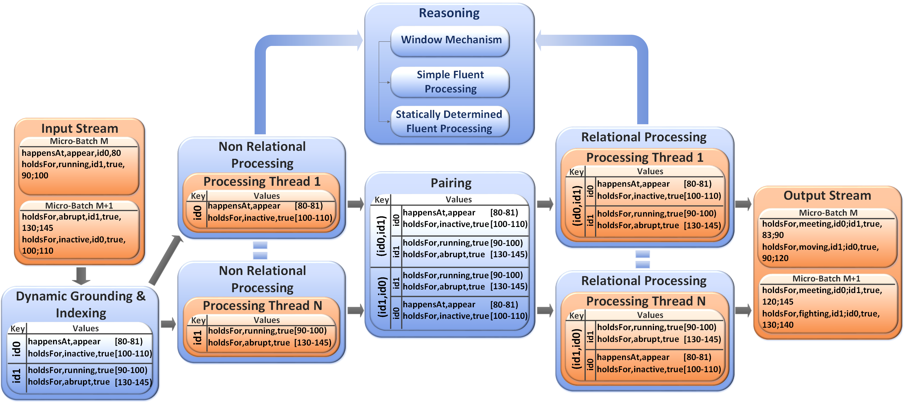

## Engine Architecture

dRTEC reasoning is the main module of the engine. The only knowledge, that takes into account is the input fluent/events, the fluents/events that have to be recognized,
and the maximum number of ids in their definitions. It has no information about the sensors' or devices' ids sending data. 
Once the data parsing is done, the engine indexes the data according to the id and executes the dynamic grounding. Then, event recognition for non-relational fluents/events - fluents and events defined by one id. Thereafter, pairing takes place.
In pairing, the engine calculates all the possible combinations of ids that the complex event recognition is related to. Finally. 
the relational processing is executed. The output of the recognition is written to a file or sent to a MQTT topic. In order the engine to be agnostic for the ids, 
dRTEC keeps a state of the former windows in an [Apache Spark SQL](http://spark.apache.org/sql/) context. The procedure described above, is illustrated in the following figure.

 
 

 
 

The description of the dRTEC architecture is only for comprehensing the engine's functionality. The programmer has access only in the 
[Classes and Data Types](2_1_classes_and_data_types.md), that are described in next section.
